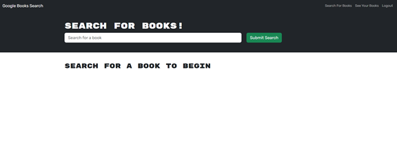
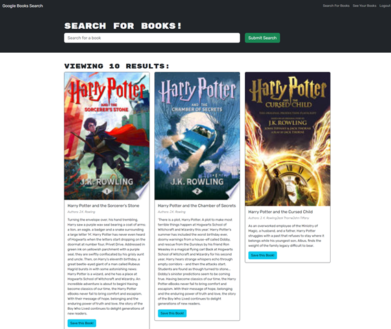
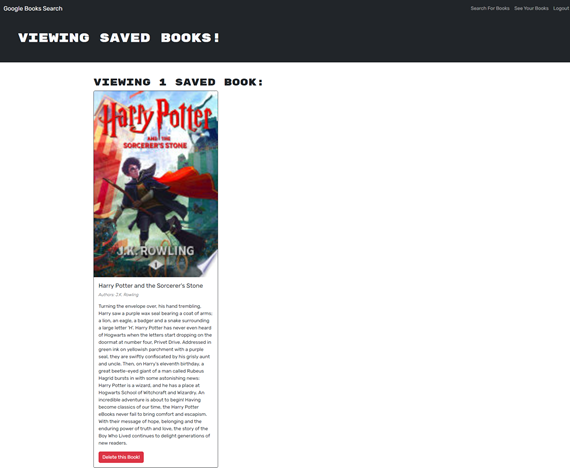

# GraphQL Book Finder

## Overview
A MERN stack application using Google Books API that has been refactored from a RESTful API to a GraphQL API using Apollo Server.

## Table of Contents
- [Features](#features)
- [Installation](#installation)
- [Usage](#usage)
- [Application Screenshots](#application-screenshots)
- [Deployed Application](#deployed-application)
- [Questions](#questions)
- [Credits](#credits)

## Features

1. Book Search

    * Users can search for books using the Google Books API. The search results display book titles, authors, descriptions, images, and links to the Google Books site.

2. User Authentication

    * The applications includes sign-up and login functionalities, allowing users to create an account and log in to the site.

3. Save Books

    * Logged in users have the option to save their favorite books to their account.

4. View Saved Books

    * Logged in users also have the ability to view a list of books they've saved to their account.

5. Remove Saved Books

    * Logged in users also have the ability to delete books from their list of saved books on their account.

6. Technologies Used

    * MongoDB
    * Express.js
    * React.js
    * Node.js
    * GraphQL
    * Apollo Client
    * JWT

## Installation

    1. Clone the repository.

    2. Run 'npm install' to install dependencies

    3. Run 'npm run build' to build the application

    4. Run 'npm run develop' to start the development server

## Usage

    1. Use the search functionality to look for books.

    2. Log in or sign up to save your favorite books.

    3. Manage saved books from your user profile.

## Application Screenshots

When on the home page, the app should resemble the following image:

When on the search page, the app should resemble the following image:

When on a user's profile page, the app should resemble the following image:

## Deployed Application
[GraphQL Book Finder](https://graphql-book-finder.onrender.com)

## Questions
You can find my GitHub profile [here](https://www.github.com/JoshMassa). 

If you have any questions, you can email me by clicking [here](mailto:joshuamassapelletier@outlook.com).

## Credits

React Docs - https://react.dev/reference/react

